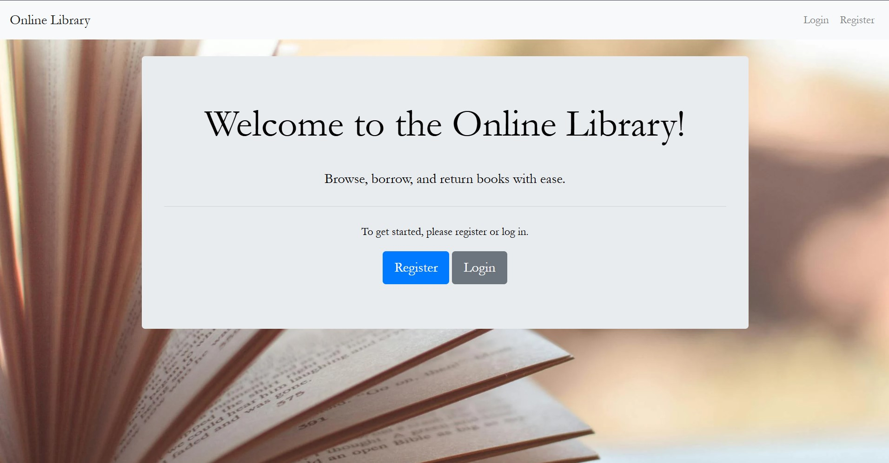

# *Online-Library*
To Present a Online library system using Flask and Python

---

### *Project Overview*

Online Library System creates an interface where an user can borrow and return books on a virtual interface. While doing so , the user can also look at the amount of titles available. Where as the admin's role of adding new titles and looking at the number of users who are currently borrowing the books .This project's aim is to create a web application using tools such as Flask and python. 

### *Steps to follow*

- Upload the whole project folder either in VS CODE or CODESPACES.

- Ensure the right packages are available and installed in the required IDE

- On the terminal type *"python app.py"* 

- This will generate a URL that will take you to a web application as shown below.

### *Prerequisites*

*TOOLS AND SOFTWARE* 

- Python 3.8 or higher
  
- Pip: Python package installer
  
- SQLite
  
- IDE

*DEPENDENCIES*

- FLASK : pip install flask
- Flask-SQLAlchemy : pip install flask-sqlalchemy
- Flask-WTF : pip install flask-wtf

### *FOLDER STRUCTURE*

1) instance - Library.db   # Has the database file
   
2) static - styles.css     # CSS file for styling
   
3) templates               # HTML templates
   a)base.html              # Base layout
   b)index.html             # Home page
   c)login.html             # Login page
   d) register.html          # Registration page
   e) browse_books.html      # Page to browse books
   f) add_book.html          # Add book page for admin
   g) borrow_book.html       # Borrow book page
   h) return_book.html       # Return book page
   
4) venv                    # Virtual environment

5) app.py                   # Main application file

6) forms.py                 # Flask-WTF forms for user input

7) env                      # Environment variables

